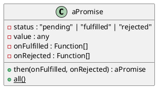

# aPromise

## 功能

- 支持a+ promise规范

## 使用

```ts
const apromise = new APromise((resolve, reject) => {
  resolve(1)
})

const apromise2 = apromise.then((value) => {
  console.log(value)
  return 2
})

async function testfn() {
  const value = await apromise2()
  console.log(value) // 2
}
```

## 分析
- 内部状态
  - status
    - pending
    - fulfilled
    - rejected
- 初始化
  - new APromise((resolve, reject) => {})
- promise的状态只能从pending到fulfilled或者rejected，状态一旦改变则不能再变
- promise必须有一个then方法，then接收两个参数，分别是promise成功的回调onFulfilled和promise失败的回调onRejected
- 如果then中的onFulfilled或者onRejected返回一个值x，则运行下面的Promise解决过程：[[Resolve]](promise2, x)
- 如果then中的onFulfilled或者onRejected抛出一个异常e，则promise2必须以e为reason被拒绝

## 类图



## 流程图

### 初始化

```ts
const apromise = new APromise<number>((resolve, reject) => {
  resolve(1)
})

apromise().then((val: number) => {
  expect(val).toEqual(1)
})
```
- 基本过程
  - 当初始化的时候传入的函数会立即执行
    - 当触发resolve的时候
      - status = fulfilled
      - 保存resolve的参数
  - 当使用then的时候
    - 如果当前状态是pending
      - 将onFulfilled和onRejected保存起来
      - 返回一个新的promise
    - 如果当前状态是fulfilled
      - 执行onFulfilled
      - 返回this
    - 如果当前状态是rejected
      - 执行onRejected
      - 返回this

### all 过程

```ts
import { APromise } from './index'

const apromise = new APromise<number>((resolve, reject) => {
  resolve(1)
})

const apromise1 = new APromise<number>((resolve, reject) => {
  setTimeout(() => {
    resolve(2)
  }, 1000)
})

APromise.all([apromise, apromise1]).then((val: number[]) => {
  expect(val).toEqual([1, 2])
})
```


